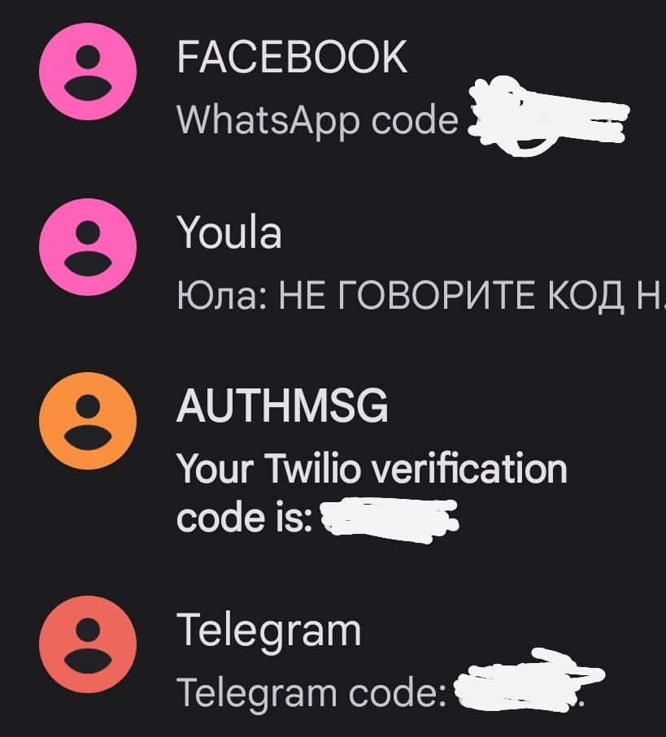
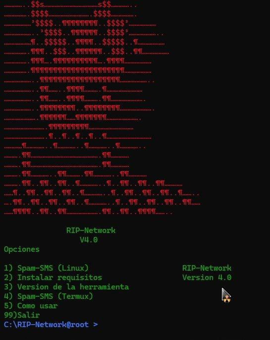

# SMS-Bomber
Herramienta para Spam de SMS echa por Python que usa redes sociales famosas funcional para Linux y Termux, la herramienta no está automatizada del todo por lo que tendrás que hacer algunas cosas manual.

No hace falta usar VPN o mucho tiempo de espera con 30 minutos serian suficientes para iniciar otro ataque ya que esta herramienta usa redes famosas y es manual la parte de enviar el SMS y llamadas haciendola mas rapida en el lapso de tiempo.

En la version 5.0 se ha añadido el archivo en bash , esto servira por si no funciona en python tener otra opcion , a la hora de ejecutar SMS.sh recuerda no tener root activado por si acaso puede dar errores.

  

# Menu 

* bash menu.sh

Esto hará mucho más fácil para poder guiarte por la herramienta.

# Como usar en Linux 

$ git clone https://github.com/RIP-Network/SMS-Bomber

$ cd SMS-Bomber

$ bash install.sh

$ pip3 install -r requeriments.txt

$ python3 SMS.py

#

$ git clone https://github.com/RIP-Network/SMS-Bomber

$ cd SMS-Bomber

$ bash install.sh

$ pip3 install -r requeriments.txt

$ bash SMS.sh

# Como usar en Termux

$ git clone https://github.com/RIP-Network/SMS-Bomber

$ cd SMS-Bomber

$ chmod +x * install.sh

$ ./install.sh

$ pip3 install -r requeriments.txt

$ python3 SMS.py

#

$ git clone https://github.com/RIP-Network/SMS-Bomber

$ cd SMS-Bomber

$ chmod +x * install.sh

$ ./install.sh

$ pip3 install -r requeriments.txt

$ bash or ./SMS.py

( La version para Termux actualmente ya esta funcionando , para usarla teneis que ejecutar el archivo SMS.sh es donde se encuentra la version para Termux. )

# Redes sociales que usa para los SMS y llamadas

La herramienta usara estas redes sociales para enviar SMS y llamadas a la victima. 

* Instagram

* Tiktok

* Snapchat

* Twitter

* Facebook 

* Yandex

* Gmail

* Outlook 

* Microsoft 

* Steam 

* GitHub ( Próximamente )

* WhatsApp 

# Mensajes 

# Terminal

# Versión

Versión 7.0

# Canal de YT

https://youtube.com/channel/UCwYRhxoXiqlDpBp-HjjzQ7w
